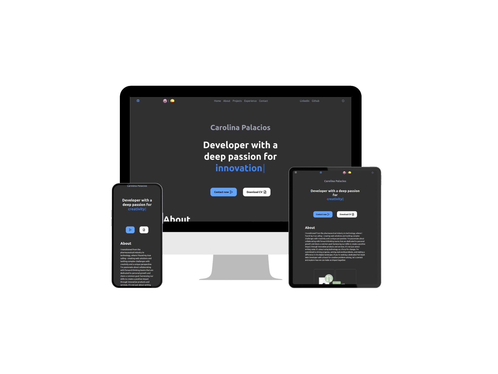

<h2 align="center">
Personal Portfolio<br/>
<a href="https://carolina-palacios.vercel.app/" style="color: #FF5D01;">carolina-palacios</a>
</h2>
<div align="center">

</div>

<h3 align="center">
    🔸
    <a href="https://github.com/carolina-palacios/portfolio/issues" style="color: #00BFFF;">Report Bug</a> &nbsp; &nbsp;
    🔸
    <a href="https://github.com/carolina-palacios/portfolio/issues" style="color: #00BFFF;">Request Feature</a>
</h3>

## ⚡️ Tech Stack

- [](https://astro.build/)

- [](https://vercel.com/)

- [](https://www.typescriptlang.org)

- [](https://reactjs.org)

- [](https://tailwindcss.com)

- [](https://github.com/carolina-palacios/portfolio)

## Open Source

You can fork this repository to modify it and make changes of your own. Please give me proper credit by linking back to [CarolinaPalacios](https://github.com/carolina-palacios/portfolio). Thanks!

## Features

- **📖 Multi-Page Layout**

- **🌙 Dark/Light Mode**

- **🎨 Styled with TailwindCSS**

- **📱 Fully Responsive**

## 🚀 Getting Started

### Prerequisites

- [](https://nodejs.org/en/)

- [](https://git-scm.com/)

## 🛠 Installation and Setup

1. Clone the repository:

```bash
## clone the repository
$ git clone https://github.com/carolina-palacios/portfolio.git

## navigate to the directory
$ cd portfolio

## install dependencies
$ npm install
```

2. Start the development mode:

```bash
## start the development mode
$ npm run dev
```

3. Open the browser and navigate to http://localhost:4321 to view the site. 🚀

## ✨ Usage

If you open the project folder and navigate to /src/components, you will find all the components you need.
You can edit your information under /src/utils/utils.ts.
Translations are in /src/i18n.

## Support

Give a ⭐ if you like this website!
